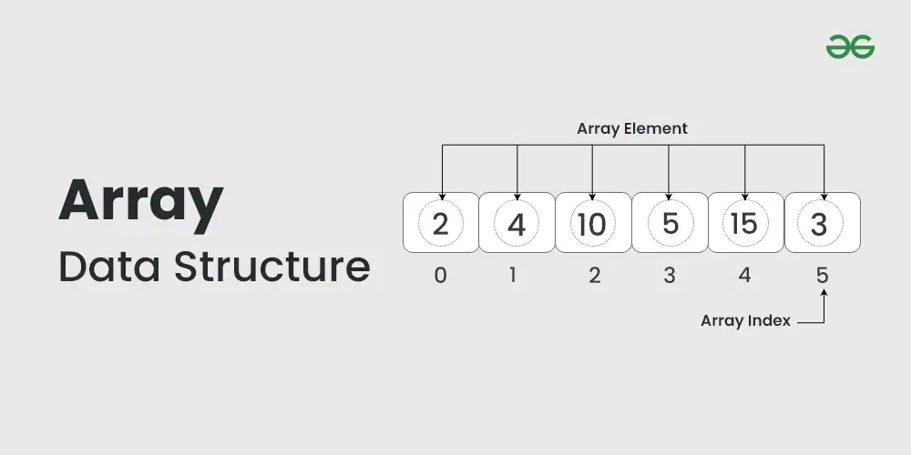
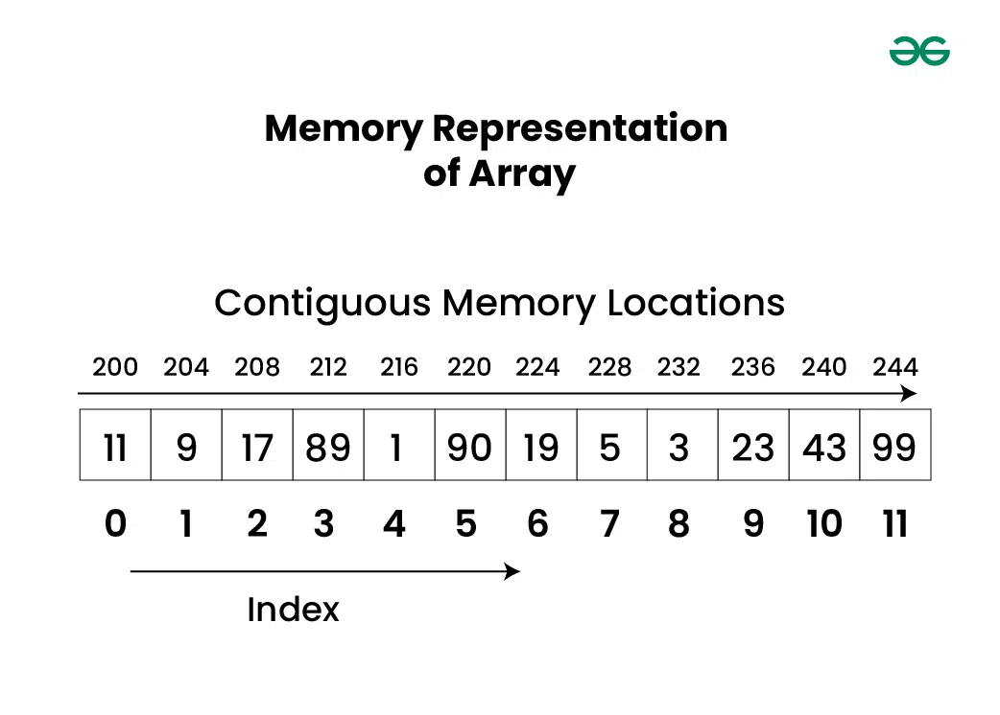
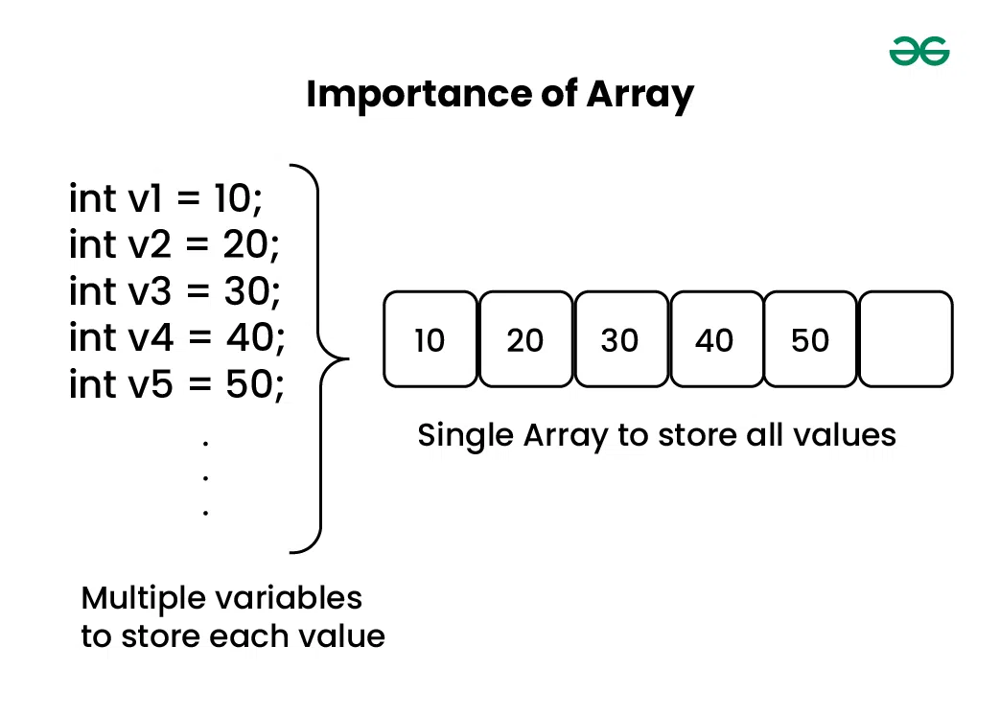

# Array 
- Array is a linear data structure that store collection of element in a contiguous memory location.
- Each item in array is indexed that start from 0 and end with last eleemnt 
- Each element of Array can be accessed by using index number

# Basic Things of Array
  - Array Index :- In Array element are identifed by their index
  - Array Elements :- It is a items that stored in index
  - Array Length :- Total Size of the Array is a length thats means how many items are stored in an array

# Memory Representation of Array
 - In an array, all the elements are stored in contiguous memory locations

 

 ## Importance of Array :

 > Assume we need to Store the marks of student like 1000 so without using Array we Stored the Marks by creating the 1000 varriable.
 - its not a good way and take lots of time 
 #### thats why we use Array so we can Store all Marks in one Array form 

  

# Types of Arrays on the basis of Memory Allocation: 
  - 1. Static Arrays: 
      #### In this type of array, memory is allocated at compile time having a fixed size of it. We cannot alter or update the size of this array. This type of memory allocation is also known as static or compile-time memory allocation. Here only a fixed size (i,e. the size that is mentioned in square brackets []) of memory will be allocated for storage.
  - 2. Dynamic Arrays: 
     #### In this type of array, memory is allocated at run time but not having a fixed size. Suppose, a user wants to declare any random size of an array, then we will not use a static array, instead of that a dynamic array is used. This type of memory allocation is also known as dynamic or run-time memory allocation. It is used to specify the size of it during the run time of any program.